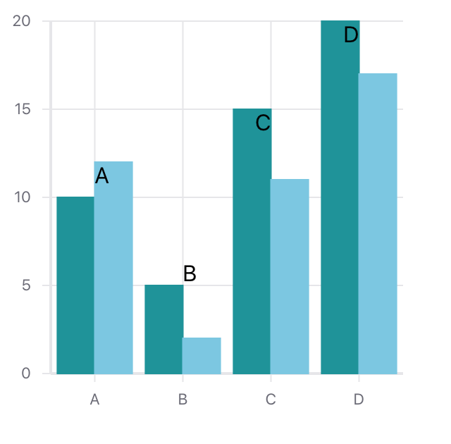
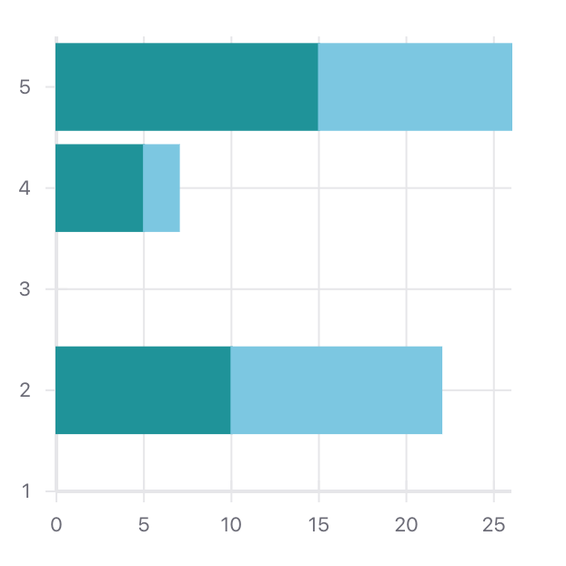
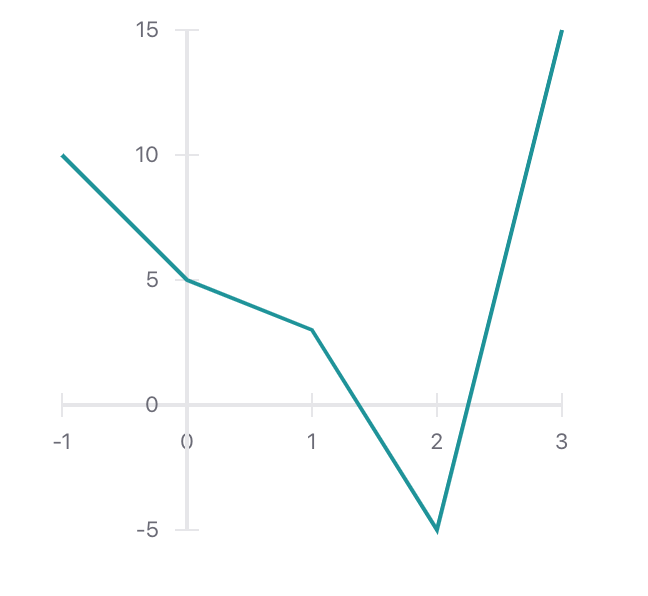
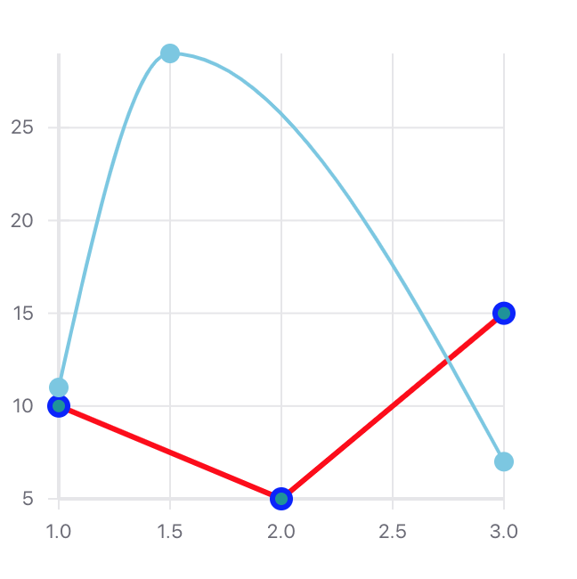

Uber Visualization Charts - react-vis examples
==============================================

## Istallation:

* Clone or download project: (git clone https://github.com/kirils/react-vis-examples.git).
* Go to your local directory where downloaded or cloned repository.
* Use command `cd ./react-vis-examples` to enter in the directory.
* Install yarn.
* Use command `yarn install` to install all modules from `package.json` file.
* Use command `yarn start` to start project.
* The project will be started on http://localhost:3000 or another free port.

## Istallation with Docker:

* Install Docker
* Clone or download project: (git clone https://github.com/kirils/react-vis-examples.git).
* Go to your local directory where downloaded or cloned repository.
* Use command `cd ./react-vis-examples` to enter in the directory.
* Use command `docker build .` to bild docker image
* After building process finish you will see image name somethink like this `b41f580d81aa`
* Use command `docker run -p 3000:3000 -it b41f580d81aa` to expose the image on port 3000
* Open in browser url http://localhost:3000/

Screenshots
-----------

BarChart

HorizontalBarChart

AxisOn0

LinemarkChart

SimpleRadialChart

